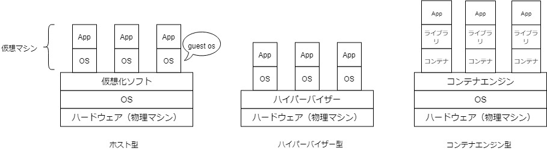

## 仮想化ソフトの分類
　仮想化ソフトは、次の3種類に大別される 
   

- ホスト型      
  　ベースとなるOS上に仮想化ソフトウェアをインストールし、その仮想化ソフトウェア上に仮想マシンを構築する。仮想マシンは特定のハードウェアマシンに依存しないため、任意のOSをインストールできる。
  　デメリットとして、ホストOSに負荷がかかると、仮想マシンのパフォーマンスが低下する。

- ハイパーバイザー型        
  　ハイパーバイザーは、動作にOSを必要とせずハードウェア上で直接動作し、複数の仮想マシンを動かすための土台となるソフトウェア。
  　ハイパーバイザー型の仮想マシンは、物理マシンのハードウェアに直接アクセスできる。
  　デメリットとして、ハードウェアを制御するための専用ドライバーが必要となる。

- コンテナエンジン型        
  　ユーザから隔離されたアプリの実行環境を作り、独立したサーバーのように実行する。ゲストOSを起動せずに、ゲストOS対応のアプリを起動する。コンテナエンジン（コンテナ管理ソフト）を起動し、ホストOSに対応するライブラリを読み込むことでアプリの起動を実現する。